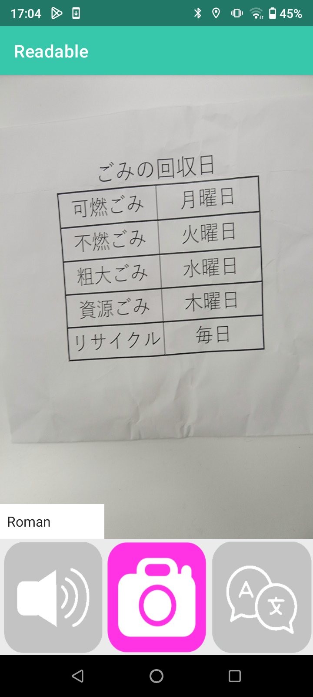
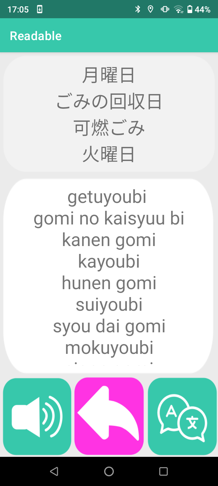
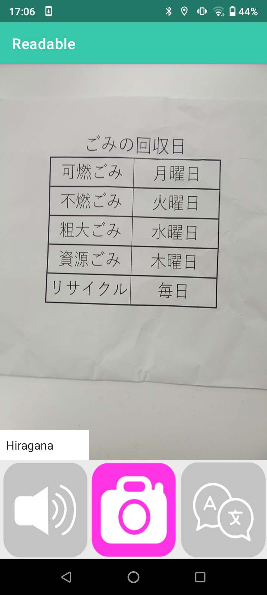
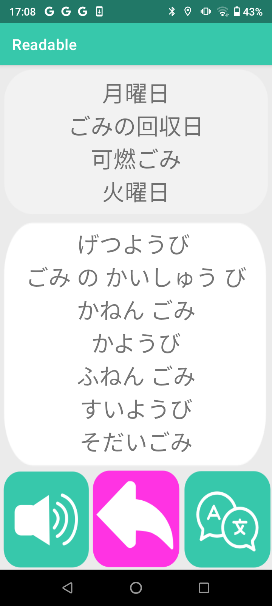
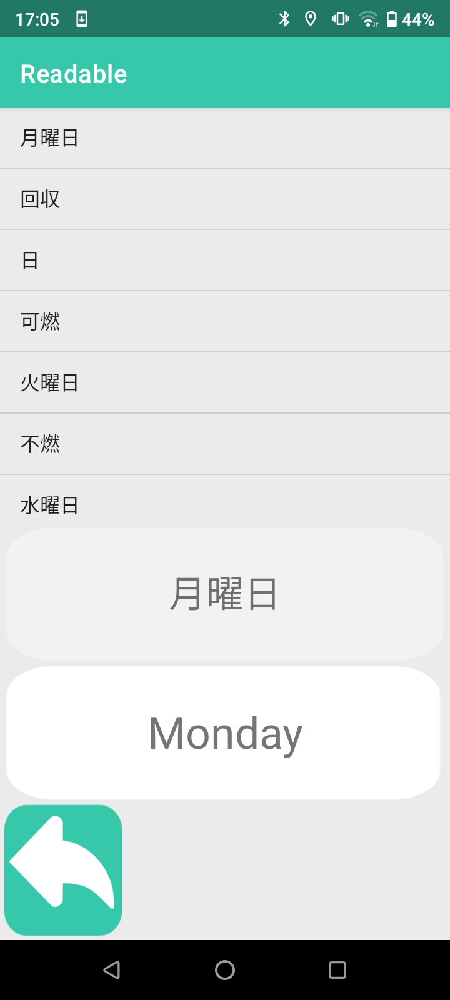

# Readable
専門学校2年前期で作成したAndroidアプリです。3人チームで作成しました。 このリポジトリにはJavaファイルしかアップしていないため、このままでは動作しません

 

## アプリ概要
このアプリは、ひらがな・ローマ字は読めるけど漢字は読めない外国人向けの変換アプリです。漢字交じりの文章をカメラで撮影すると、ひらがなのみ・ローマ字のみの表記に変換します。単語一覧から、単語の意味を英訳することができます。

 

## 使用技術
- Java
- Android Studio
- Camera X
- ML Kit
- Deepl API
- Yahoo!のルビ振りAPI

 

## 担当場所
ローマ字・ひらがなへの変換機能と、単語を一覧で取得し英訳する機能の実装

 

## エピソード
プログラミングを学んでから2回目のアプリ開発ということもあり、1回目よりはスムーズに開発を進めることができました。HTTPリクエストについても学び、APIで想定道理の通信ができるようになりました。

 

## アプリの画面
カメラで変換したいものを撮影する。ローマ字モード

画面上半分に読み取った漢字交じりの文、下半分にローマ字へ変換した文が表示される

左下からひらがなモードに変更可能

ひらがなで変換されるようになる

単語一覧と、単語の意味を英訳する機能

